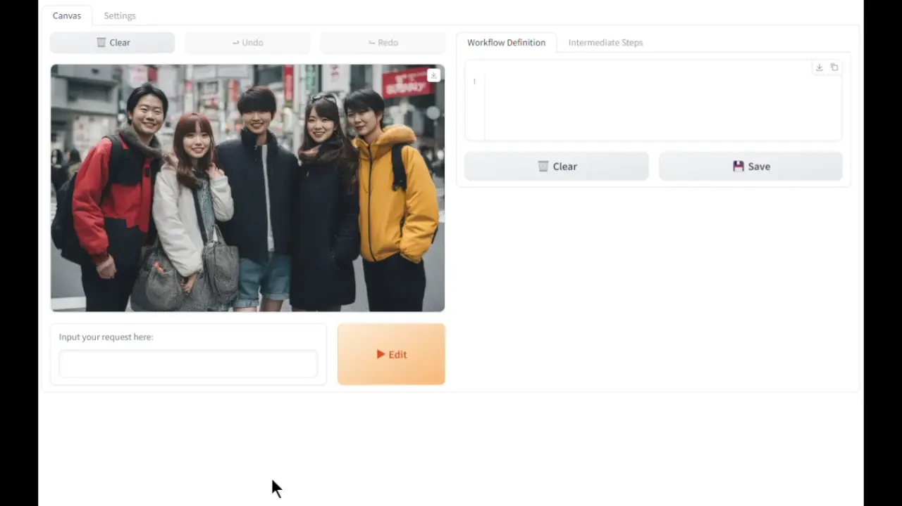
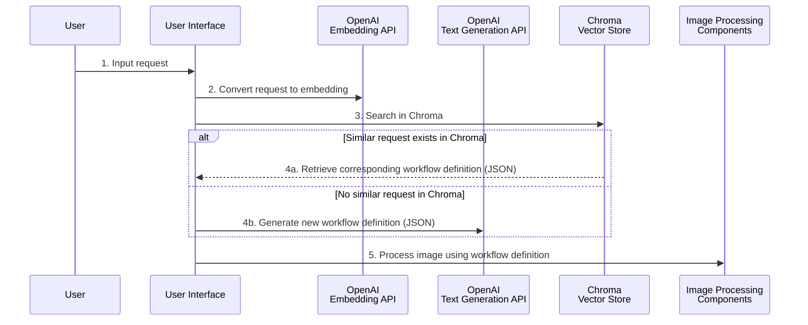
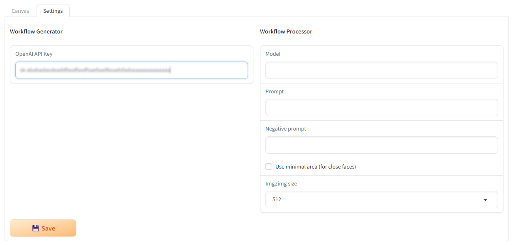
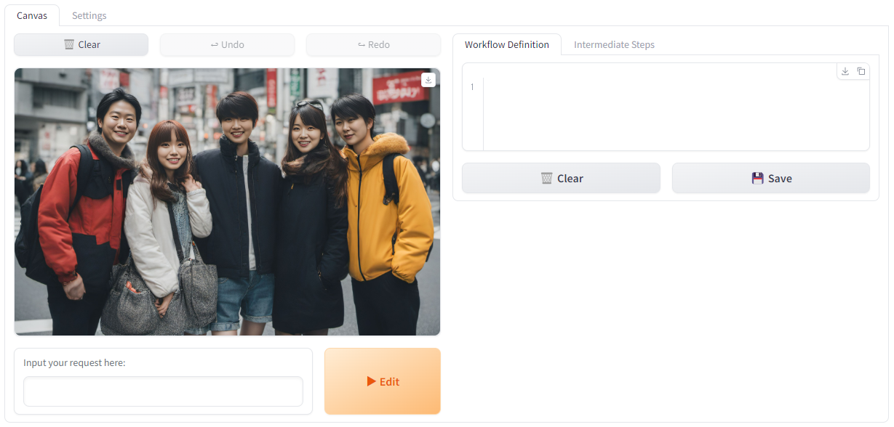
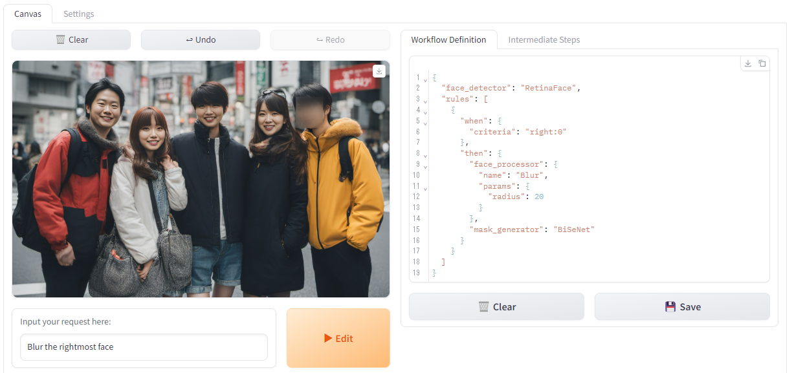

# imgflw
A demo application for image editing using LLM.



## imgflw Application Processing Flow


- [OpenAPI Schema Specification for Workflow](./imgflw/components/core/workflow_generators/workflow.yml)

## Installation and Launch
Clone this repository:

```bash
git clone https://github.com/ototadana/imgflw
cd imgflw
```

Install [PyTorch 2.1](https://pytorch.org/) and [xFormers](https://github.com/facebookresearch/xformers):

Example command:

```bash
pip install torch torchvision xformers --index-url https://download.pytorch.org/whl/cu121
```

Install required software:

```bash
pip install -r requirements.txt
```

To launch the application:

```bash
python main.py
```

## Initial Setup
Once the interface appears in the browser, switch to the "Settings" tab. Enter your API key in "Workflow Generator - OpenAI API Key" and click "Save".



## Editing Images
1. Upload the image you want to edit.
  

2. Describe how you want to edit the image in "Input your request here:" and click "Edit".
  

## License
This software is released under the MIT License, see [LICENSE](./LICENSE).

## Acknowledgements
This application has been developed with the support of several outstanding software resources:

#### Workflow Definition Generation
- [OpenAI Text generation API](https://platform.openai.com/docs/guides/text-generation/text-generation-models)

#### Workflow Definition Storage
- [OpenAI Embeddings API](https://platform.openai.com/docs/guides/embeddings/embeddings)
- [Chroma](https://docs.trychroma.com/)

#### Image Processing
- [Face Editor](https://github.com/ototadana/sd-face-editor)
- [Diffusers](https://huggingface.co/docs/diffusers/index)
- [facexlib](https://github.com/xinntao/facexlib)
- [Real-ESRGAN](https://github.com/xinntao/Real-ESRGAN)
- [OpenCV](https://opencv.org/)
- [Pillow](https://python-pillow.org/)

#### User Interface
- [Gradio](https://www.gradio.app/)